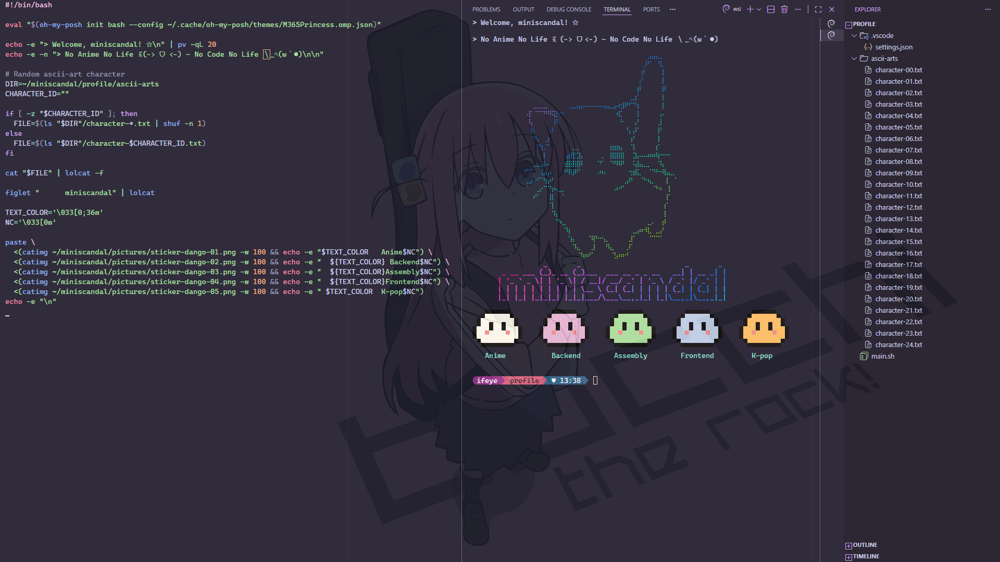
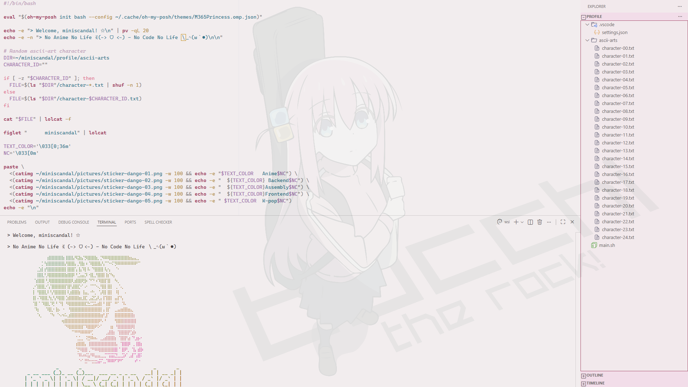

# My Coding Space

I’m sharing my VSCode setup. It includes configurations, customizations, and extensions.  
I believe a personalized environment not only boosts productivity but also lifts mood and motivation.

<!-- markdownlint-disable MD033 -->

<!-- markdownlint-disable MD033 -->

---

## Important Recommendation

(≧◠‿◠≦)

Always back up your current settings before customizing — it’ll save you trouble down the road.

---

## Extensions by Profile

(≧◠‿◠≦)

### Default Profile (applies to all profiles)

#### Productivity ✰

- [Toggle](https://marketplace.visualstudio.com/items?itemName=rebornix.toggle)
- [Code Spell Checker](https://marketplace.visualstudio.com/items?itemName=streetsidesoftware.code-spell-checker)  
- [CodeSnap](https://marketplace.visualstudio.com/items?itemName=adpyke.codesnap)  
- [Markdown All in One](https://marketplace.visualstudio.com/items?itemName=yzhang.markdown-all-in-one)  
- [markdownlint](https://marketplace.visualstudio.com/items?itemName=DavidAnson.vscode-markdownlint)  

#### Aesthetics ✰

- [Background](https://marketplace.visualstudio.com/items?itemName=Katsute.code-background)
- [Minimalist Product Icon Theme](https://marketplace.visualstudio.com/items?itemName=ElAnandKumar.el-vsc-product-icon-theme)  
- [Power Mode](https://marketplace.visualstudio.com/items?itemName=hoovercj.vscode-power-mode)
- [Catppuccin for VSCode](https://marketplace.visualstudio.com/items?itemName=Catppuccin.catppuccin-vsc)
- [Gruvbox Concoctis](https://marketplace.visualstudio.com/items?itemName=wheredoesyourmindgo.gruvbox-concoctis)
- [Light Pink Theme](https://marketplace.visualstudio.com/items?itemName=mgwg.light-pink-theme)
- [Meridian Theme](https://marketplace.visualstudio.com/items?itemName=britown.vscode-theme-meridian)
- [Zenith Theme](https://marketplace.visualstudio.com/items?itemName=britown.vscode-theme-zenith)

#### Useful Tools ✰

- [REST Client](https://marketplace.visualstudio.com/items?itemName=humao.rest-client)  
- [Remote Development](https://marketplace.visualstudio.com/items?itemName=ms-vscode-remote.vscode-remote-extensionpack)  
- [Remote Explorer](https://marketplace.visualstudio.com/items?itemName=ms-vscode.remote-explorer)  
- [GitLens — Git supercharged](https://marketplace.visualstudio.com/items?itemName=eamodio.gitlens)

---

### PowerShell Profile

- [PowerShell](https://marketplace.visualstudio.com/items?itemName=ms-vscode.PowerShell)  
- [shell-format](https://marketplace.visualstudio.com/items?itemName=foxundermoon.shell-format)  

### Python Profile

- [Python (Environments, Debugger, Pylance)](https://marketplace.visualstudio.com/items?itemName=ms-python.python)  
- [Pylint](https://marketplace.visualstudio.com/items?itemName=ms-python.pylint)  
- [Black Formatter](https://marketplace.visualstudio.com/items?itemName=ms-python.black-formatter)

### JavaScript Profile

- [ESLint](https://marketplace.visualstudio.com/items?itemName=dbaeumer.vscode-eslint)  
- [Angular Language Service](https://marketplace.visualstudio.com/items?itemName=Angular.ng-template)  
- [Microsoft Edge Tools](https://marketplace.visualstudio.com/items?itemName=ms-edgedevtools.vscode-edge-devtools)  

### Java Profile

- [Extension Pack for Java](https://marketplace.visualstudio.com/items?itemName=vscjava.vscode-java-pack)  
- [Spring Boot Extension Pack](https://marketplace.visualstudio.com/items?itemName=vmware.vscode-boot-dev-pack)

---

## Configuration Files

(≧◠‿◠≦)

I keep things minimal. Most UI elements are hidden.
I use shortcuts to toggle them when needed, so I stay focused.

### Settings Rules

This file stores my editor preferences: themes, UI tweaks, and extension settings.  
✰ [settings.json](./config/settings.json)

---

### Keybinding Rules

This file defines my custom shortcuts to speed up coding and boost productivity.  
✰ [keybindings.json](./config/keybindings.json)
