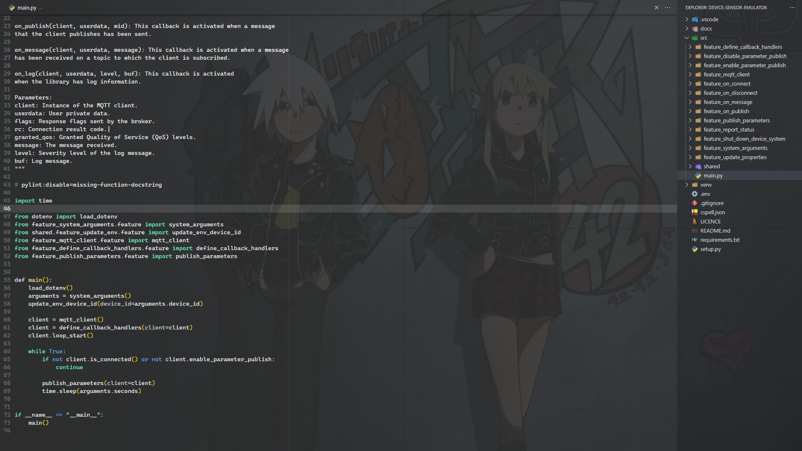
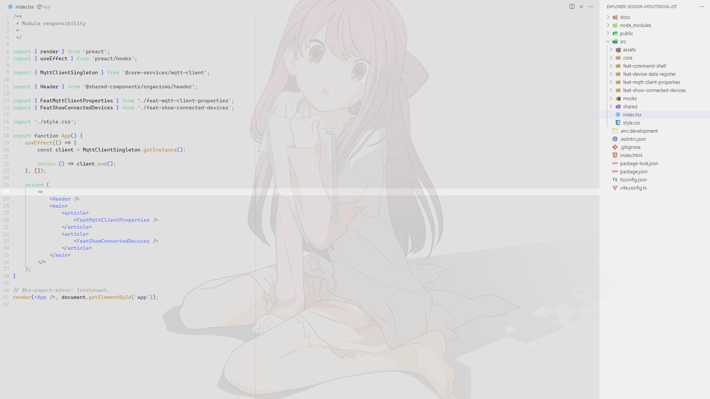

# Mi espacio para escribir código

Te comparto mi configuración y las extensiones que utilizo en Visual Studio Code.

## Recomendación importante
≧◠‿◠≦

Es importante que no olvides hacer un respaldo de tu configuración actual.

## Extensiones generales
≧◠‿◠≦

[Background](https://marketplace.visualstudio.com/items?itemName=Katsute.code-background) |
[Code Spell Checker](https://marketplace.visualstudio.com/items?itemName=streetsidesoftware.code-spell-checker) |
[Fresh and Sober Color Theme](https://marketplace.visualstudio.com/items?itemName=marco87dev.fresh-and-sober-color-theme)  
[Indenticator](https://marketplace.visualstudio.com/items?itemName=SirTori.indenticator) |
[Polacode](https://marketplace.visualstudio.com/items?itemName=pnp.polacode) |
[vscode-icons](https://marketplace.visualstudio.com/items?itemName=vscode-icons-team.vscode-icons)

## Extensiones de perfil
≧◠‿◠≦

### Python

[Python](https://marketplace.visualstudio.com/items?itemName=ms-python.python) |
[Pylint](https://marketplace.visualstudio.com/items?itemName=ms-python.pylint)

### JavaScript

[ESLint](https://marketplace.visualstudio.com/items?itemName=dbaeumer.vscode-eslint) |
[Angular Language Service](https://marketplace.visualstudio.com/items?itemName=Angular.ng-template)

### Java

[Extension Pack for Java](https://marketplace.visualstudio.com/items?itemName=vscjava.vscode-java-pack) |
[Gradle for Java](https://marketplace.visualstudio.com/items?itemName=vscjava.vscode-gradle) |
[Spring Boot Extension Pack](https://marketplace.visualstudio.com/items?itemName=vmware.vscode-boot-dev-pack)

## Archivo de configuración

Me gusta el minimalismo, por lo que la mayoría de elementos y marcas visuales  
están ocultos. Los elementos que utilizo están configurados con un atajo para  
mostrarlos u ocultarlos según sea necesario, lo que me ayuda a mantenerme enfocado.

## Atajos de teclado

He configurado atajos de teclado que me resultan fáciles de recordar y que me  
permiten ser más eficiente y productivo.
